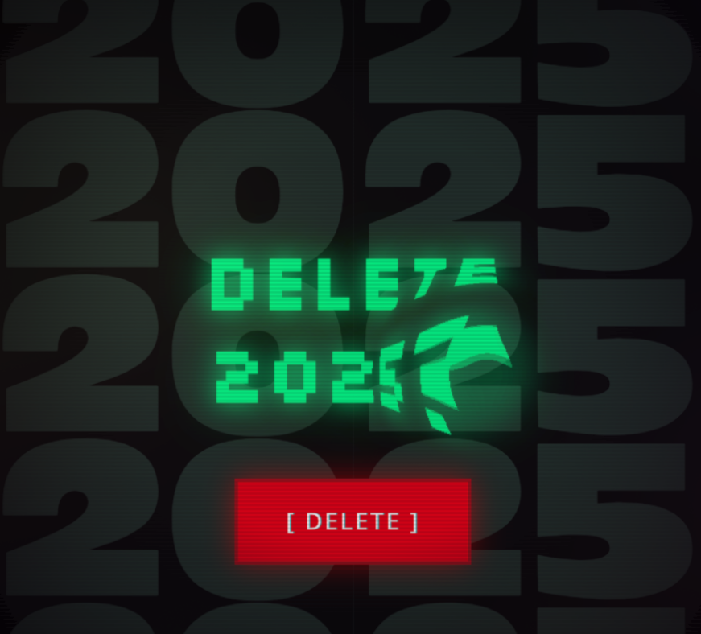
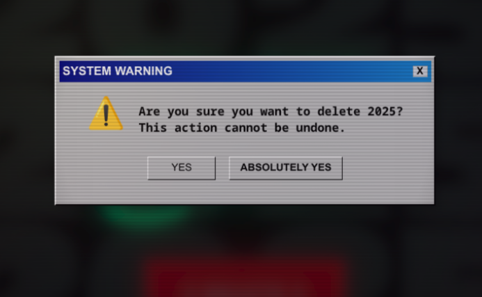
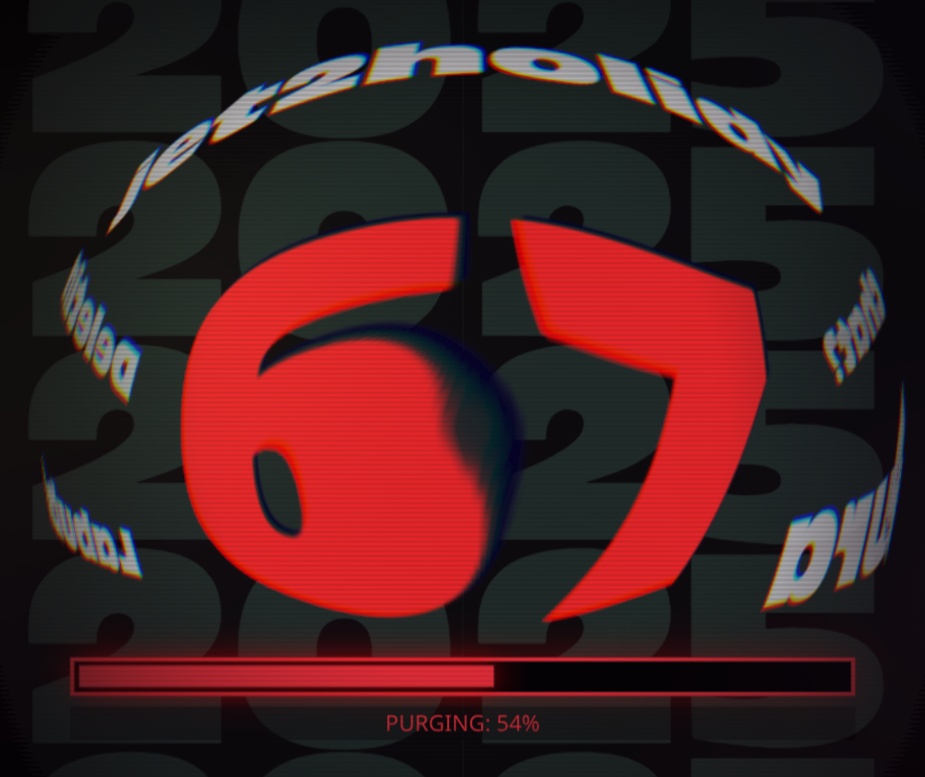
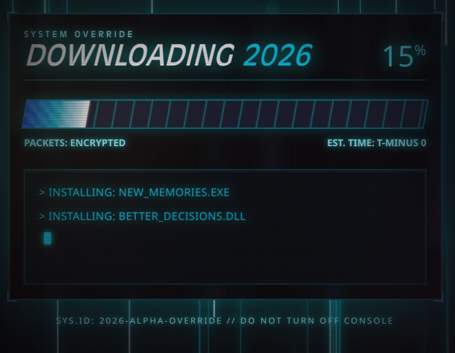
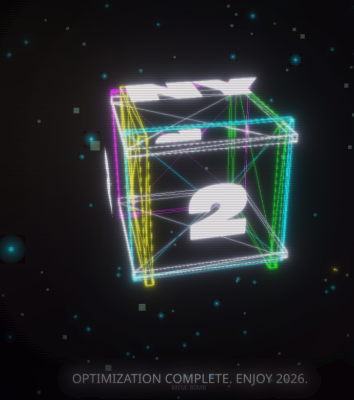
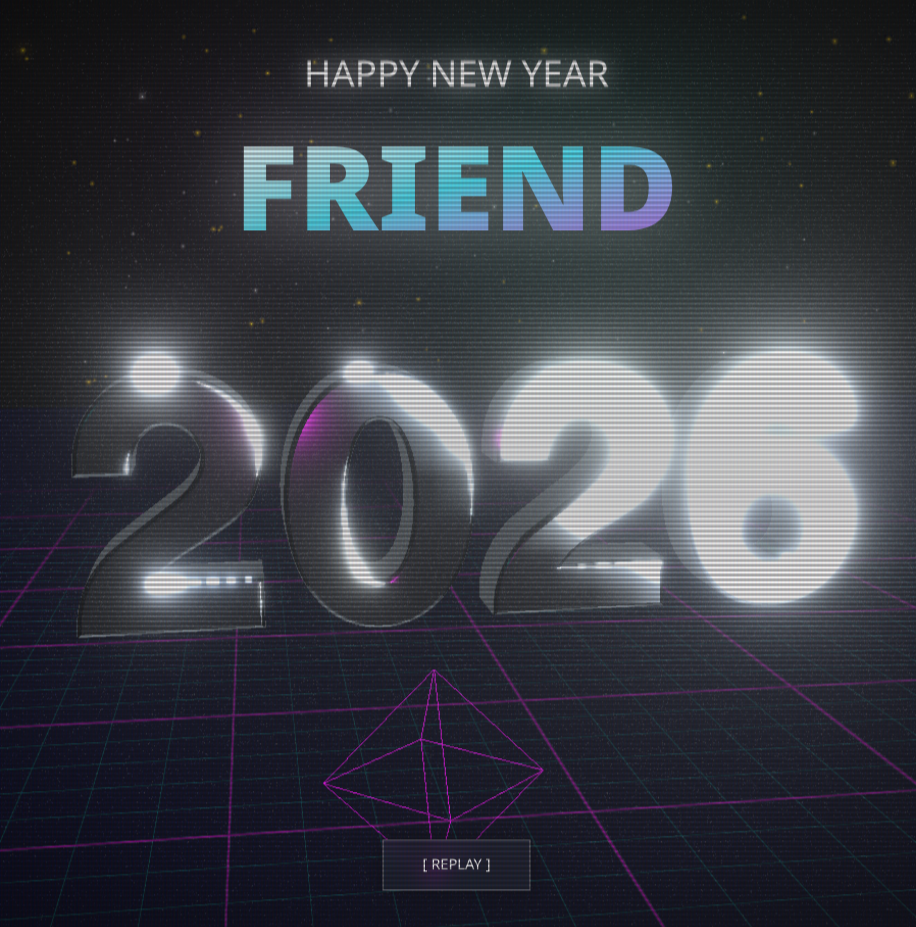

# 🌐 NY26 | System Reboot

A cinematic, Digital win98 inspired look, New Year's experience built with **Next.js**, **React Three Fiber**, and **Framer Motion**.

**Live Demo:** [ny26-rho.vercel.app](https://ny26-rho.vercel.app)

---

## 🚀 scences

NY26 is an interactive journey through the "System Reboot" of our reality. The experience is divided into several acts:

1.  **ACT I: THE ARRIVAL** - OS Boot sequence and protocol initialization.
2.  **ACT II: THE OLD WORLD** - Identification of 2025 trends and memories.
3.  **ACT III: DELETION** - User-triggered purge of the previous year.
4.  **ACT IV: DOWNLOAD** - High-speed installation of 2026 modules.
5.  **ACT V: INSTALLATION** - 3D Cube optimization and life-habit patching.
6.  **ACT VI: REVELATION** - Majestic chrome reveal of 2026.

---

## 👤 Personalized Celebration

You can customize the experience for anyone!

**To customize the name:**
Simply add `?name=YourName` to the end of the URL.

*Example:*  
`https://ny26-rho.vercel.app/?name=Elon`

---

## 📸 Screenshots

<div style="display: flex; gap: 10px; overflow-x: auto; padding-bottom: 10px;">
  
  
  
  
  
  
</div>

---

## 🛠️ Tech Stack

- **Framework:** Next.js 16
- **3D Engine:** React Three Fiber (Three.js)
- **Animations:** Framer Motion
- **Post-Processing:** @react-three/postprocessing (Bloom, Chromatic Aberration, Vignette)
- **Audio:** Web Audio API (Procedural SFX) & HTML5 Audio (BGM)
- **Styling:** Tailwind CSS

---

## 💻 Local Development

1.  Clone the repository
2.  Install dependencies:
    ```bash
    pnpm i
    ```
3.  Run the development server:
    ```bash
    pnpm dev
    ```
4.  Open [http://localhost:3000](http://localhost:3000)

---

## 🎵 Sound Design

The project features a custom procedural audio engine for tactile UI feedback (typing, glitches, whooshes) and a cinematic background music transition that peaks during the final revelation.

# Happy 2026 🚀